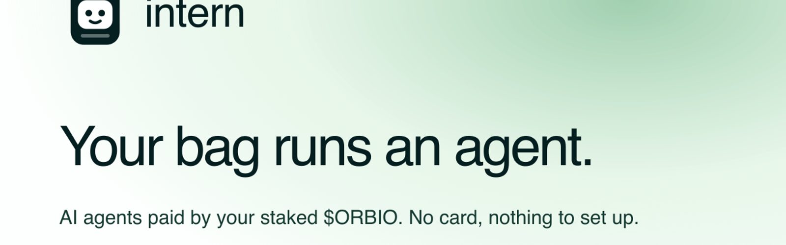

<p align="center"></p>

<p align="center">
  <a href="https://intern.money">intern.money</a> ·
  <a href="https://intern.money/sky">The sky</a> ·
  <a href="https://intern.money/docs">Docs</a> ·
  <a href="https://t.me/intern_agents_bot">Telegram bot</a>
</p>

---

**Your bag runs an agent.** Write a job in one sentence. An AI intern does it on your schedule, paid by the CREDIT your staked $ORBIO earns. No card, no API key, nothing to install. Sell the bag and it stops.

Every run leaves a public receipt on Robinhood Chain: cost, model, duration, tools used and a sha256 of what it wrote.

## What it does

| | |
|---|---|
| **Fund** | Staked $ORBIO mints Orbio CREDIT every hour (1 CREDIT = $1 of AI). You activate CREDIT from your own wallet; your signature of Orbio's key message is the key runs are billed to. Intern never holds tokens or a private key. |
| **Work** | Market watch (tokens, pools, wallets on Robinhood Chain), repo watch (read repos, open PRs and issues), digest (pages you name), custom. One sentence becomes a plan you can edit before launch. |
| **Report** | Telegram, Discord, the intern's public page, PDF/DOCX on request. Every claim links its source. |
| **Prove** | Each run is hashed and anchored on Robinhood Chain. Actions are read back from the provider and marked verified, mismatch or not checked. |
| **Watch cheaply** | Alert jobs get a free 15-minute tripwire; the AI wakes only when a number crosses your line. |
| **Ask** | Draft → approve → act. Emails, PRs, posts and new interns wait for your OK; Autopilot is a separate switch. |
| **Fuel** | Anyone can burn 1, 2 or 5 of their own CREDIT into a public intern's balance with one signature. |

## How a run works

```
one sentence ──compile──▶ plan (you review, you edit) ──launch──▶ your schedule, your cap
      │
      ▼
 AI balance = CREDIT you activated − what runs spent      key = your wallet's signature of Orbio's key message
      │
      ▼
 model loop (via Orbio's gateway, billed to that key)
   tools: token_market · chain_read · web_search · web_fetch · github_read · open_pull_request · open_issue
          comment_on_issue · post_tweet · write_document · deliver
   budget: hard per-run cap; stops before crossing it and says what it skipped
      │
      ▼
 report → sha256 → Robinhood Chain → public page → Telegram / Discord / files
```

## Verify it

- Every public intern on [the sky](https://intern.money/sky) lists its runs with their hash and transaction.
- `GET /api/interns/:id/runs` returns each run with `outputHash`, `txHash` and `explorerUrl`.
- Receipts are sent from the receipts wallet to a fixed anchor address with no code; the calldata is `abi(internId, runId, outputHash, costMicroUsd, timestamp)`. Addresses are on the [docs page](https://intern.money/docs#contracts).

## Run it yourself

```bash
pnpm install
cp .env.example .env.local        # SECRET_KEY at minimum; see comments per connection
pnpm dev                          # http://localhost:3000
curl localhost:3000/api/cron/tick # run due interns once (production does this every minute)
```

`DATABASE_URL` takes a libsql/SQLite URL or a Postgres URL. `ANCHOR_PRIVATE_KEY` (a little ETH on Robinhood Chain) turns on-chain receipts on; without it runs are hashed only.

## Repository map

```
src/intern/        the runtime: compile, run, schedule, tools, approvals, connections, budget, anchoring, store
src/app/           Next.js app: landing, docs, sign-in, /app, /sky, /s/[id], /api/*
src/components/    UI, mascot, brand marks
tests/             vitest; fakes for every third party
```

## Tests

```bash
pnpm exec vitest run --no-file-parallelism
```

`tests/acceptance.test.ts` is the index: one named case per promise above (approvals act once, rejected drafts have no effect, private content never goes public, read-back mismatches are flagged, spending caps hold under a race, new interns always ask).

---

<p align="center"><sub>CREDIT by Orbio · receipts on Robinhood Chain · <a href="https://intern.money">intern.money</a></sub></p>
